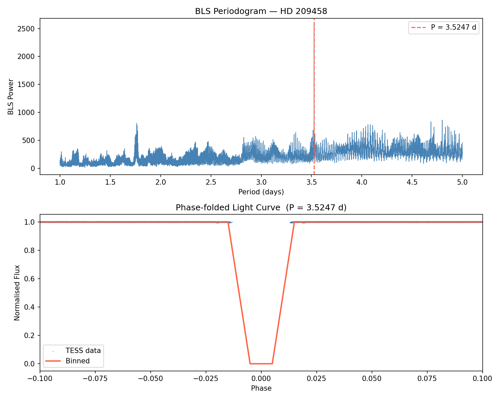

# Exoplanet Transit Detection with TESS

## Summary: 
This is my first ever project in Python and proper data modelling! I believe that this is a really good spot to start with computational astro projects - so I will also be defining various terminology at the bottom.

## Background: 
HD209458b is a hot Jupiter, one of the first confirmed exoplanets, and is very well studied.

## Method: 
I downloaded TESS photometry from MAST, ran BLS periodogram, phase-folded and binned the light curve.

## Results: 
recovered period of 3.5247 days, matches the known period, clear transit dip visible.

## Dependencies: 
NumPy, Matplotlib, Astropy, Lightkurve

## Terminology: 
hot jupiter - class of gas giant exoplanets that are generally considered to be very similar to Jupiter and Saturn, orbit extremely close to their parent stars

MAST - Mikulski Archive for Space Telescopes (MAST) Portal - allows astronomers to search space telescipe data, spectra, images and publications (holy grail)

BLS periodogram - statistical tool (part of Astropy) speficially used for detecting transiting exoplanets and specific binaries

phase-folding - astronomical data analysis technique that stacks multiple, separate cycles of periodic data (eg. planet transits) on top of each other to form a simple and cohesive cycle

binned - processed, lower-resolution version (in the context of lightkurve - of a stellar light curve created by grouping multiple data points into bins), used to reduce noise, scatter and data volume